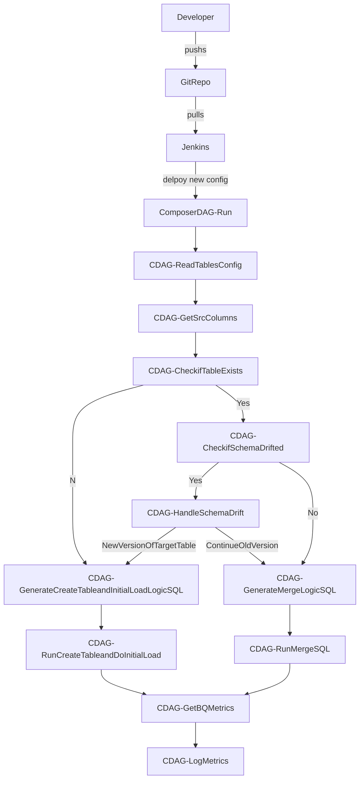
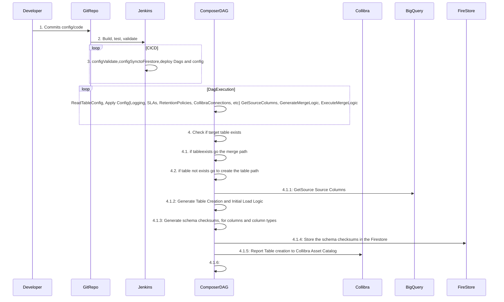

# Downstream Data Processing - Composer Based(Airflow)

The design and architecture aligns to industry proven practices of DataDevOps, No-Ops, SRE(Site Reliability Engineering) model, Lean Agile.

## Features

##### 1. Config Driven - driven by config/\*_table.yml

##### 2. Capture Schema Drift

##### 3. Enable Cloud Logging - Stackdriver and Generate logs for DashBoarding (Separate Bucket)

##### 4. Generate Metrics, Telemerty, Report MTBF, MTTR,MTTF,MTTA, Records through put

##### 5. Talk to Data Governance Tool like Collibra at every step of transformations for reporting(Data/Technical Lineage)

##### 6. Data Quality

##### 7. Testing Framework for DAGS

##### 8. Restartability of DAGS and Data Pipelines

##### 9. SLA Management

##### 10. Retention Policies on Data Assests

#### Far Fetched Features

##### 11. Rolling Updates, Canary Deployments?, Planned Downtimes

##### 12. Web Console for editing table config files... for biz like users

##### 13. Defining the datapipeline as configuration, dataconfiguration vs control configuration(job/workflow/processing)

Description:

Some features listed above will require config entries in the tables_*.yaml file .

Above list can be segregated into three categories
1. Data Plane
2. Control Plane
3. Ops Plane

Data Plane deals with talking about configuration and handling of sources, tables and columns.
Control Plane deals with processing/job/workflow of datasets/dataassets/tables, deals with the transformations and integrations steps need on end-to-end data processing.
Ops Plane deals with providing machinery for No-ops/Zero-ops model or under minimal supervison of systems, include self-healing, auto-erorr recovery, aim to provide easy interfaces for biz like users to directly talk/interact with data processing framework being built, governance systems.

## Design

## ERDs
### Hub Stage to Hub

#### Type2


## FlowChart


<br>
<br>

## Sequence Diagram



##### 1.Config Driven - driven by config/\*_table.yml
###### 1.1 Algorithm
Every table entry will have following sections in config file.

Tables config may have global config to be applied across workflows;
1. Collibra EndPoints
2. ServiceNow Endpoints
3. Firestore Endpoints


**TODO** The each table config can end up in separate file or bunch of tables can end up in a single file.
Table level config should have Solutions Tagging for every table like SIR, AgriStats, etc

```
    - SourceTable:
      Name: Name of the source table
      Version: 3.4
      ExcludeColumns for checksum:
      KeyColumns:
        -Key1
        -Key2
        -Key3
      TargetTable:
        Name: Name of the table
        targetType: type2/type1
      RetentionPolices:
        HotDays:
        WarmDays:
        ColdDays:
        PurgeFlag:
      Partitioning:
        Columns:
        -Column1
        -Column2
        -Column3
      Logging:
        LogLevel: 'info'/'critical'/'warn'
        LogBucket: 'path"
      SLA:
        SLI:
        SLO:
        SLA:
      Endpoints:
        - Collibra
        - ServiceNow
      DataQuality:
        - Completeness
        - Timeliness
        # - other 4 dimensions
      Labels:
        ProjectTags:
          -Covid
          -SIR
          -AgriStats

```

##### 2.How to handle schema drift.(generate column checksum)
###### 2.1 Description:
The framework will detect schema drift both in terms of changing number of columns and column types.
We need to have Version scheme into table names to accomodate, effient handling of shcema drift. <br>
for example:
When the source table **'hub_stage.ABC'** has a current schema as follows:

| ColumnName        | ColumnType          | Description  |
| ------------- |:-------------:| -----:|
| Col1      | String | Col1 Describe |
| Col2      | Date      | Col2 Description   |
| Col3 | Integer      | Col3 Description    |

The above version of the table can start at X.Y, .i.e **'hub.ABC_0_1'** <br>
where X represent the addition and deletions to the columns, when a new column is added say Col4 the Schema Change handler will create a new table with as **'hub.ABC_1_1'**
and Y represents the change in Column types, Let's say when Col2 changed from Date to TimeStamp, then Schema Change handler will create a new table with as **hub.ABC_0_1'**

But then the following cases araise; <br>
1. The current load of **'hub.ABC_0_1'** will continue to happen along with the new version, till the ChangeManagement Process kicks-in and handled accordingly.
   1. The loading of current table may not happen if the changed column is bigger data type than the original one. In this case an alert is raised by the system.
   2. The system will continue to newer version and collibra is reported to add the new asset.

Ops-handling:
The Team responsible with solution can make the decision to update the config, to consume newer version of changed table.
The Composer DownStream Processing Framework will constantly be in sync with Collibra and to update metrics, new artifacts

###### 2.1 Algorithm

1. Parse the config file for tables and column info
2. if first run generate columns checksum and store it in Firestore
3. if subsequent runs , compute checksums for the source table columns names and compare with Firestore checksum on
   columns
   1. if varying
      1. create a new type2 table with versioning info X.Y , X represent change in columns, Y represent change
  in column types
      2. generate insert logic
      3. Run initial insert logic
      4. update the checksum in Firestore.
      5. update current if required.

   2. if same the checksums are same on columns
      1. Generate merge statement
      2. run the merge logic

##### 3.Enable Cloud Logging

Crafting the log messages for collecting metrics is the key for easy-peasy ops model.
Log Messages will contain following information for filtering, delineation and further reporting purposes.

1. Process Name/Job Name
2. Process Instance/Job Instance
3. Process Start/End
4. Process-SubTask Id
5. Process-SubTask Start/End
6. Process-SubTask Metrics
7. Add ABAC Audit Balance and Control info
8. Add a Column in each data record to hold JSON payload to speak/track about the path/process lineage it took

Processes should return Enterprise Standard Error Codes for uniformity amongst applications.

Standard Practices and Procedures can be applied when application hits a particular error state/code, Ops guys can follow a standard playbook.

System will try to auto/self heal from the error state before alerting.

System will have capability, to help Ops Guys with extensive recommended actions/procedures and playbooks to follow to bring into a consistent state.

System will create ITSM ticket with respective tool(Service-Now) with SLA's defined from config files for a particular table(s).

System should be planned to

##### 7.Testing Framework for DAGS

###### 1.Test cases for config/hourly_tables.yml

###### 2.Testing DAGS

#### TODOs

+ Add type1 loading into destination area/dataset, add load types into YAML file.
+ Create storage bucket for stackdriver and route the logs
+ Build a tiny Dashboard for showing the capbility
+ Change the DAG file name to represent hourly load from hub_stage to hub.
+ Add partitioning and sharding to the table creation DAG
+ Change the template file name to have extension as .template
+ SLAs
+ Store the SQLs being run into CloudStorage or Firestore or?, version them and provide links to download for error/bug tracking in the system, and for reporting
+ Hook to type2 from DICE instead of Current view

#### Features expected from up stream

1. Table versioning, DICE should publish list of versions available for a `dataset.Table`.
2. DICE should handle schema drift by versioning the source tables.
